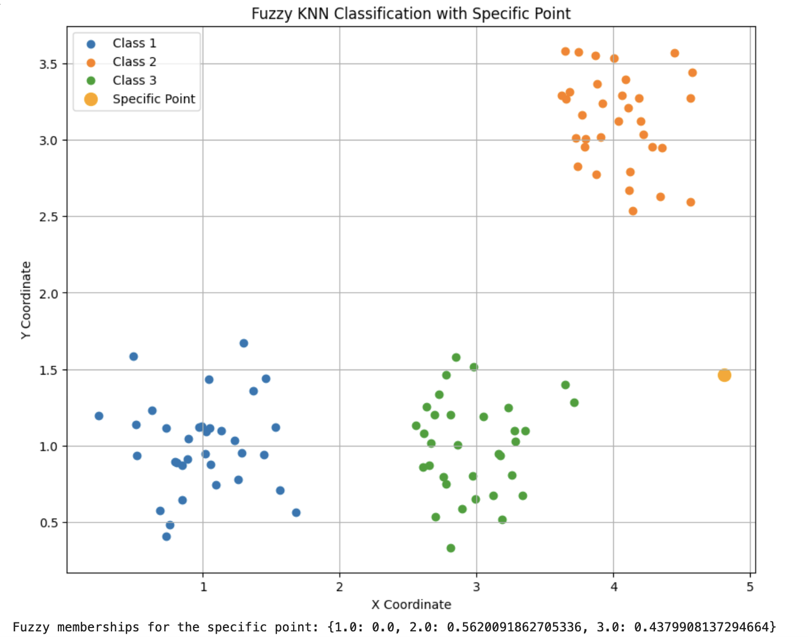
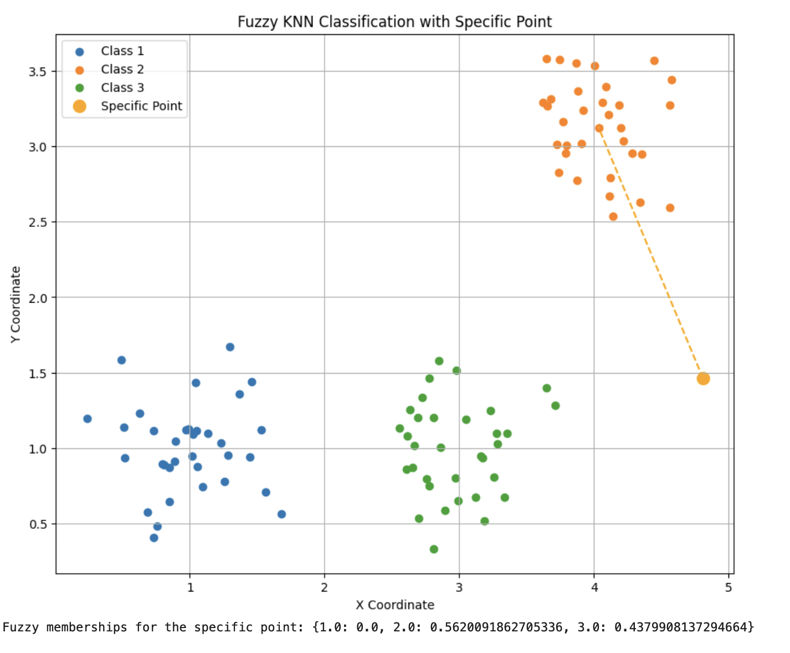
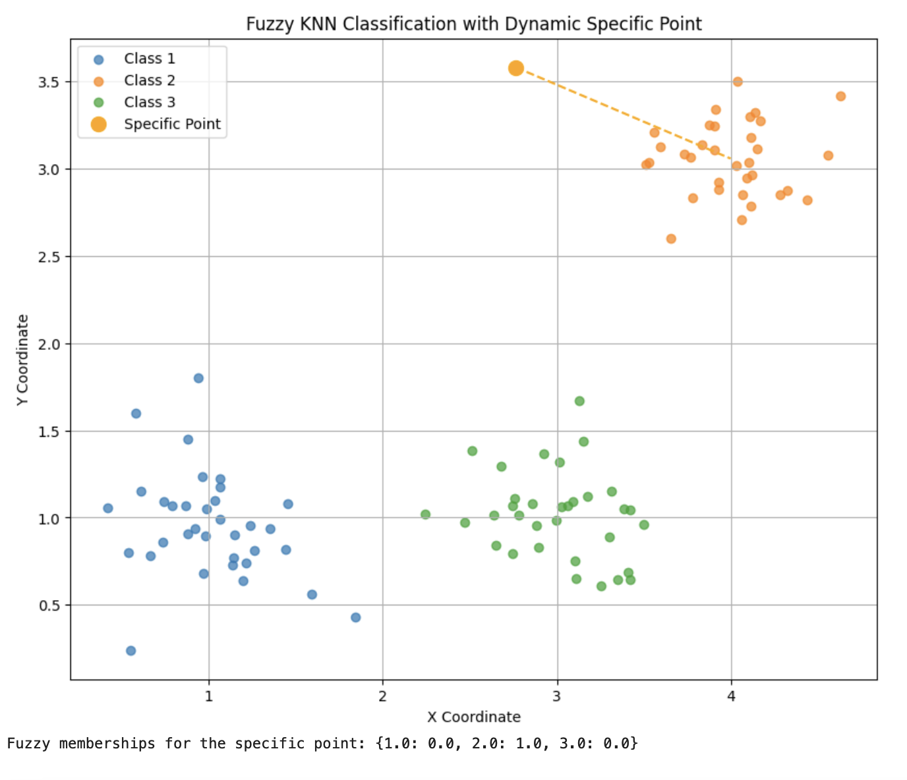
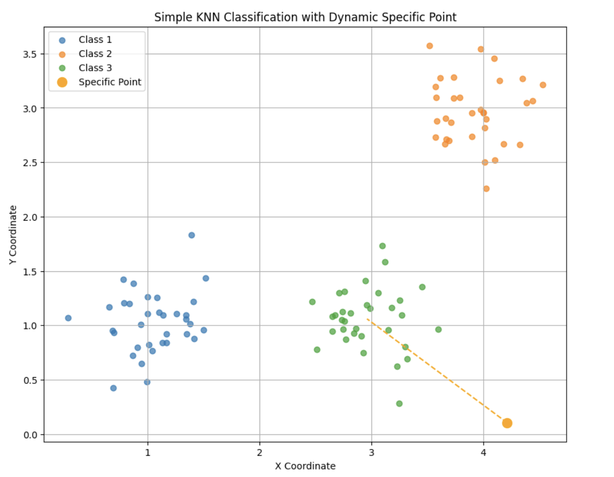

# KNN and Fuzzy KNN Classification

This repository contains Python code for implementing both Simple KNN and Fuzzy KNN classification on a synthetic dataset. Each code snippet generates a specific point randomly within a given range and predicts its class based on the k-nearest neighbors' method. Fuzzy KNN uses membership values to determine the likeliness of a point belonging to each class.

## Description

The project includes four Python scripts:
- `Code1.py` implements Fuzzy KNN classification and plots the result.
- `Code2.py` is similar but additionally plots a line from the specific point to the class center based on the highest membership.
- `Code3.py` further refines the Fuzzy KNN approach with dynamic plotting.
- `Code4.py` simplifies the approach using a basic KNN without fuzzy logic, determining the class with a majority vote among the nearest neighbors.

## Installation

To run these scripts, you need Python installed on your system along with the following packages:
- numpy
- matplotlib

You can install the required packages using pip:
```bash
pip install numpy matplotlib
```

## Usage

To run any script, simply execute it with Python. For example:
```bash
python Code1.py
```

## Results

Each script outputs a plot visualizing the classification:

- **Code1: Fuzzy KNN Classification with Specific Point**
  

- **Code2: Fuzzy KNN Classification with Dynamic Specific Point**
  

- **Code3: Fuzzy KNN Classification Adjusted for Class Center**
  

- **Code4: Simple KNN Classification with Dynamic Specific Point**
  

## Contributing
Pull requests are welcome. For major changes, please open an issue first to discuss what you would like to change.

Please make sure to update tests as appropriate.

## License
[MIT](https://choosealicense.com/licenses/mit/)
